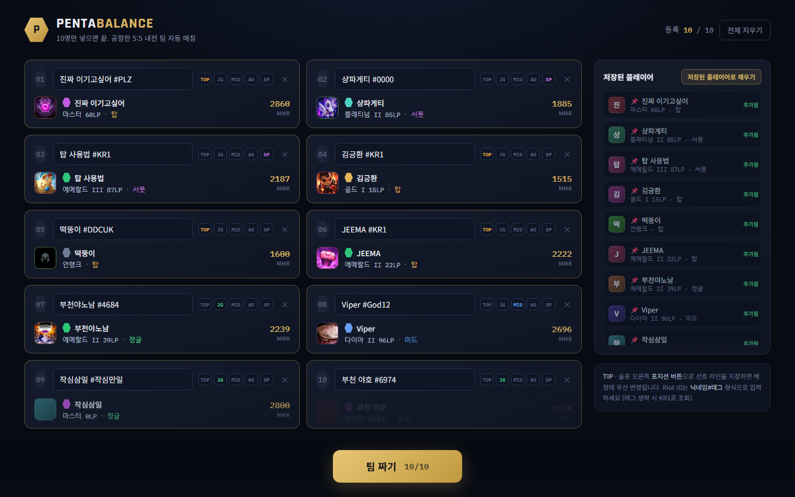
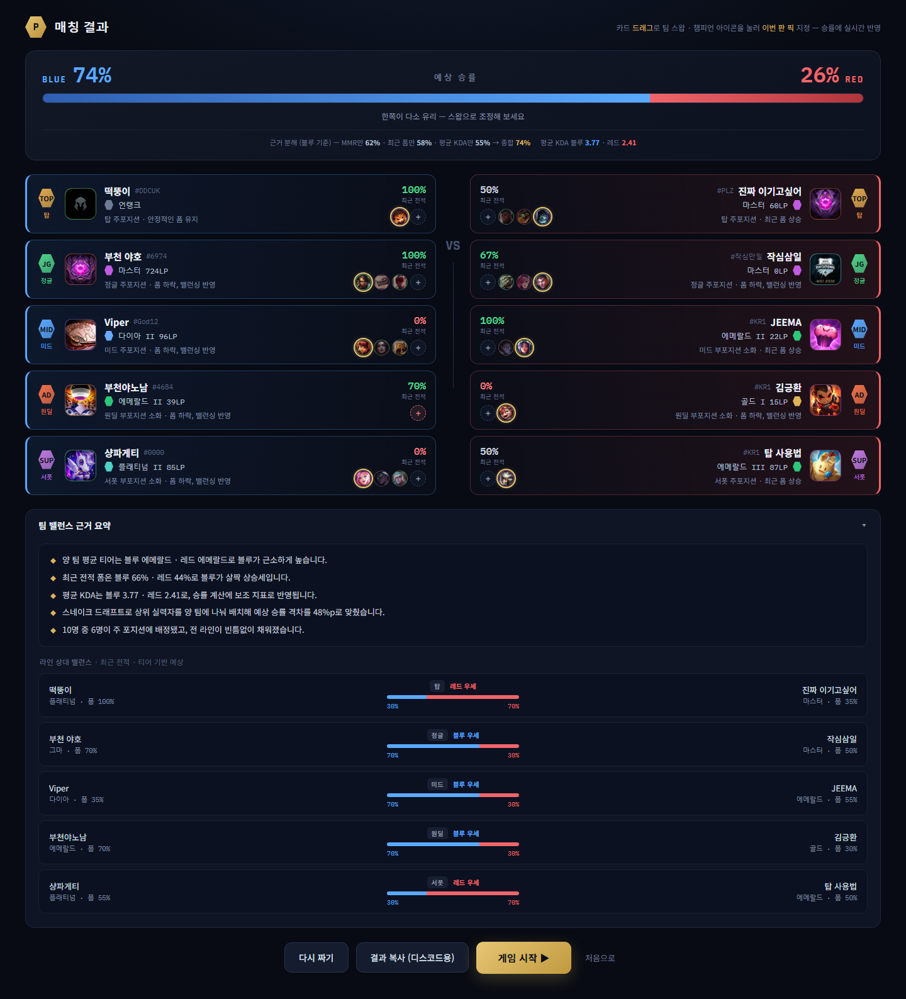
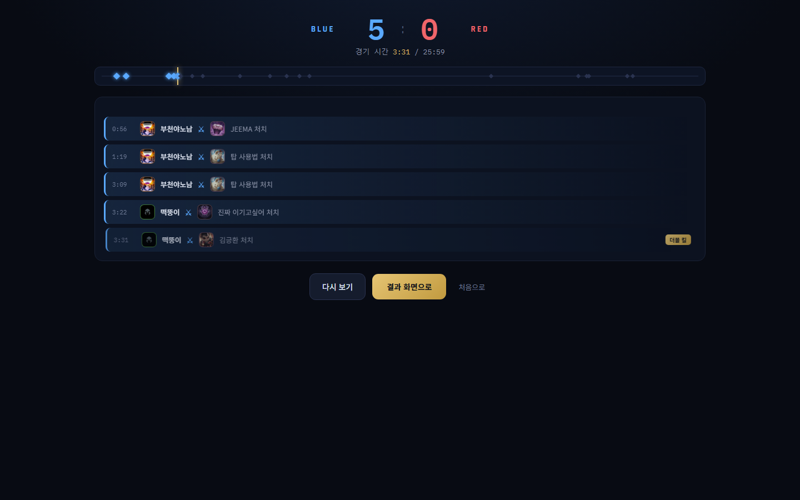
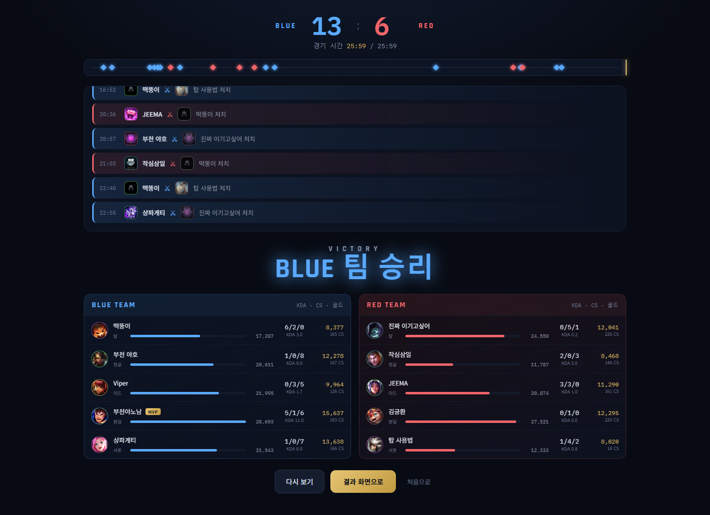

# PENTABALANCE

리그 오브 레전드 5:5 내전, 팀을 어떻게 나눠야 할지 고민될 때 쓰는 팀 밸런스 매칭 웹앱입니다.
소환사 10명의 실제 전적을 불러와서 최대한 공평하게 두 팀으로 나눠줍니다.

**바로 써보기**: https://pentabalance.onrender.com

## 사용법

1. 사이트에 접속해서 참가자 10명의 소환사명을 `닉네임#태그` 형식으로 입력합니다 (예: `Hide on bush#KR1`).
   - 예전에 입력했던 사람은 사이드바에 저장돼 있어서 클릭 한 번으로 다시 채울 수 있어요.
2. 10명이 다 채워지면 자동으로 전적을 분석해서 티어에 맞게 두 팀(블루/레드)으로 나누고, 예상 승률을 보여줍니다.
   - 알고리즘 기반 매칭 외에 **"AI로 짜기"** 버튼을 누르면 AI가 대신 팀을 짜고 왜 이렇게 나눴는지 설명도 해줍니다.
3. 결과가 마음에 안 들면 카드를 드래그해서 팀을 바꾸거나, "다시 짜기"로 새로 조합할 수 있습니다.
4. 챔피언 아이콘을 눌러서 이번 판에 픽할 챔피언을 지정하면 승률에도 반영됩니다.
5. "결과 복사" 버튼으로 디스코드에 바로 붙여넣을 수 있는 팀 구성표를 복사할 수 있습니다.
6. "게임 시작"을 누르면 계산된 승률과 각자의 실제 평균 기록을 바탕으로 가상 경기가 킬 피드와 함께 재생됩니다 (그냥 재미로 보는 기능이에요).

## 스크린샷

| 입력 | 매칭 결과 |
|---|---|
|  |  |

| 게임 시뮬레이션 (진행 중) | 게임 시뮬레이션 (종료) |
|---|---|
|  |  |

## 자주 묻는 질문

**팀은 어떻게 나뉘나요?**
각자의 티어 점수, 최근 폼(승률), 평균 KDA를 종합해서 최대한 비슷한 실력끼리 두 팀에 골고루 배분합니다.
AI/LLM 없이 순수 계산으로 나누는 방식과, Gemini AI가 직접 판단해서 나누는 방식 두 가지를 고를 수 있어요.

**입력한 정보가 저장되나요?**
소환사 정보는 내 브라우저에만 저장됩니다(다른 사람에게 공유되지 않아요). 다만 서버에 미리 등록된
"공용 로스터" 멤버는 접속한 모두에게 보입니다.

**왜 가끔 조회가 느리거나 실패하나요?**
Riot API 호출 제한 때문에 순서대로 처리하다 보니 인원이 많으면 시간이 좀 걸릴 수 있어요. 특정 소환사
조회가 실패해도 나머지 인원 매칭은 계속 진행됩니다.

---

## 개발자용

아래는 로컬에서 직접 실행하거나 코드를 수정하고 싶은 사람을 위한 내용입니다.

### 구조

```
/                   프론트엔드 (React + Vite + TypeScript)
  src/
    types.ts          공유 타입 (Player, Slot, Teams, GameResult, ...)
    lib/
      tier.ts          점수 <-> 티어 표시 변환
      positions.ts      포지션 메타데이터
      colors.ts          팀(블루/레드) 색상 팔레트
      balance.ts        스네이크 드래프트 + 포지션 배정 + 로지스틱 승률 계산
      gameSim.ts         킬 이벤트 기반 게임 시뮬레이터 (실제 평균 스탯 기반)
      api.ts             백엔드 호출 (lookup, analyze NDJSON 스트림, roster, champions, AI 매칭)
      storage.ts          localStorage 기반 "저장된 플레이어" 목록
      avatar.ts           아바타/챔피언 아이콘 CDN 유틸
    hooks/useSlots.ts   10슬롯 입력 상태 관리
    components/         재사용 UI 컴포넌트 (ResultCard, ChampionPicker, BalanceSummary, ...)
      game/                게임 시뮬레이션 화면 서브컴포넌트 (ScoreHeader, KillFeed, TeamScoreboard, ...)
    screens/             입력 / 분석중 / 결과 / 게임 시뮬레이션 4개 화면
    App.tsx              화면 전환 + 팀 빌드 + 드래그앤드롭 + 분석 스트림 오케스트레이션
server/              백엔드 (Express) — Riot API 프록시 + AI 매칭
  src/
    riot.ts           Riot API 호출 래퍼 (fetch + 캐시 + 큐 + 타임아웃)
    queue.ts            레이트리밋 큐 (high/low 우선순위 2단계, 20req/1s·100req/2min 준수)
    cache.ts             TTL 인메모리 캐시 (매치 상세는 사실상 영구 캐시)
    ddragon.ts            Data Dragon 버전/챔피언 한글명 캐시
    profile.ts             Riot ID -> Player 프로필 집계 로직 (라인별 챔피언 통계, 평균 KDA 등)
    roster.ts               고정 멤버 목록 (서버 공유 로스터)
    gemini.ts                Gemini API 호출 래퍼
    aiMatch.ts               AI 매칭/분석 오케스트레이션 (검증, 재시도, 예산 관리)
    aiGuard.ts                AI 호출 동시성/일일 한도/IP 레이트리밋
    aiBaseline.ts              AI 매칭 결과 밸런스 검증용 베이스라인 계산
    index.ts                라우트: /api/meta, /api/champions, /api/roster, /api/lookup, /api/analyze, /api/ai/*
```

### 1. Riot API 키 발급

https://developer.riotgames.com 에서 Riot 계정으로 로그인 후 **Personal API Key**를 발급받으세요.
Personal key는 실제 라이브 데이터를 그대로 가져오지만 **24시간마다 만료**되므로 매일 재발급이 필요합니다.

```
cd server
cp .env.example .env
# .env 를 열어 RIOT_API_KEY=RGAPI-... 를 방금 발급받은 키로 교체
```

AI 매칭 기능까지 쓰려면 https://ai.google.dev 에서 Gemini API 키를 발급받아 `.env`의
`GEMINI_API_KEY`에도 넣어주세요. 없어도 나머지 기능은 정상 동작하고 `/api/ai/*`만 503을 반환합니다.

### 2. 의존성 설치

```
npm run install:all
```

### 3. 개발 서버 실행 (프론트 + 백엔드 동시 실행)

```
npm run dev:all
```

- 프론트엔드: http://localhost:5173
- 백엔드: http://localhost:8787 (Vite가 `/api`를 자동 프록시)

### 기능 상세

#### 입력 화면
- Riot ID(`닉네임#태그`) 10슬롯, blur/Enter 시 실제 Riot API로 조회
- 슬롯 상태 4종: 빈 / 로딩 / 완료(티어·MMR·포지션 표시) / 에러(존재하지 않는 소환사)
- 슬롯별 포지션 선호 토글
- 조회에 성공한 플레이어는 localStorage에 자동 저장되어 "저장된 플레이어" 사이드바에 누적, 다음 내전에 재사용 가능
- 서버에 고정 등록된 "공용 로스터"(`server/src/roster.ts`) 멤버는 누가 접속하든 자동으로 목록에 떠서 바로 채우기 가능

#### 분석 중 화면
- `POST /api/analyze` 가 NDJSON 스트림으로 플레이어별 진행 상황(단계 텍스트 포함)을 실시간 전송
- 순차 체크리스트 + 전체 진행률 바 + 현재 처리 중 텍스트
- 특정 플레이어 조회가 실패해도(레이트리밋 등) 입력 화면에서 이미 확인된 정보로 폴백하여 전체 흐름이 멈추지 않음

#### 매칭 결과 화면
- 블루/레드 팀, 로지스틱 함수 기반 예상 승률 게이지 + 근거 분해(MMR만/폼만/KDA만 반영했을 때 각각 몇 %인지)
- 포지션순 카드, 드래그 앤 드롭으로 팀 간 스왑 → 승률 실시간 재계산
- 카드 위 챔피언 아이콘을 클릭해 이번 판 픽 지정 (실전 승률 반영) — 옆의 "+" 버튼으로 전체 챔피언 검색도 가능
- 접히는 "팀 밸런스 근거 요약" 패널: 자연어 요약 문장 + 라인별(TOP/JG/MID/AD/SUP) 블루-레드 매치업 바 비교
- 라인 실전 데이터가 없는 부포지션 선수는 MMR 영향력을 낮춰서 승률에 반영 (전체 평균 쪽으로 보정)
- "AI로 짜기": Gemini가 직접 팀을 구성하고 근거를 자연어로 분석 (일일/동시/IP 호출 한도로 보호됨)
- 다시 짜기 / 결과 복사(디스코드용 텍스트) / 게임 시작 / 처음으로

#### 게임 시뮬레이션 화면 (재미 기능)
- "게임 시작" 클릭 시 계산된 승률과 각 선수의 **실제 평균 스탯**(킬/데스/어시스트/CS/골드/데미지)을 기반으로 가상 매치를 생성
- 실시간 킬 스코어 헤더, 타임라인(마커+플레이헤드), 멀티킬 라벨(더블/트리플/쿼드라/펜타 킬)이 순차 공개되는 킬 피드
- 승리 배너 애니메이션 → MVP·데미지바가 있는 팀별 스코어보드 순서로 공개
- 라인 실전 데이터가 아예 없는 선수는 "게임 시작" 시 챔피언 직접 선택을 요구 (엉뚱한 챔피언으로 조용히 시뮬레이션하지 않음)
- 실제 킬 이벤트에서 K/D/A가 파생되므로 블루 팀 총 킬 = 레드 팀 총 데스가 항상 일치

### 사용한 Riot API
- **Account-V1**: Riot ID -> PUUID
- **Summoner-V4**: 프로필 아이콘
- **League-V4**: 솔로랭크 티어/디비전/LP -> MMR 환산 점수
- **Match-V5**: 최근 20경기(입력 화면 미리보기는 10경기) 승률, 주 포지션 추정, 최근 폼(상승/유지/하락), 라인별 챔피언 통계, 실제 평균 K/D/A·CS·골드·데미지
- **Champion-Mastery-V4** *(보너스)*: 숙련도 TOP3 챔피언 — 최근 전적이 적을 때 시그니처 챔피언 아이콘을 보완
- **Spectator-V5** *(보너스)*: 현재 게임 진행 여부를 감지해 슬롯/카드에 `● LIVE` 배지 표시
- **Data Dragon**: 챔피언 한글명, 챔피언/프로필 아이콘 이미지, 전체 챔피언 목록(픽 검색용)

### 승률 계산 방식
알고리즘 모드는 AI/LLM 호출 없이 순수 계산(로지스틱 함수)으로 승률을 냅니다. 각 팀의 (1) MMR 합,
(2) 최근 폼(승률) 합, (3) 평균 KDA 합의 격차를 구해 `1/(1+e^(-diff/650))` 시그모이드에 넣어 확률로
변환하고, MMR을 가장 크게, 폼·KDA는 보조 지표로 반영합니다(`src/lib/balance.ts`의 `rates()`). 선수가
실전 데이터 없는 라인에 배정되면(부포지션 오프라인) 그 선수의 MMR 영향력을 낮춰서, 안 하는 라인의
랭크가 그대로 승률을 흔들지 않도록 보정합니다.

AI 모드는 익명화된 선수 데이터(puuid/이름/티어 문자열 제거)를 Gemini에 보내 팀 구성과 승률, 라인별
근거를 직접 받습니다. `server/src/aiBaseline.ts`로 계산한 밸런스 기준을 벗어나면 재시도하고, 응답
스키마 검증에 실패해도 재시도하며, 실패가 반복되면 알고리즘 모드로 자연스럽게 폴백합니다.

### 레이트리밋 대응
Personal key 제한(20req/1s, 100req/2min)을 넘지 않도록 서버에 우선순위 2단계(high/low) 큐를 두어 모든
Riot 호출을 직렬화합니다. 사용자의 실시간 조회(lookup/analyze)는 항상 `high` 우선순위로 즉시 처리되고,
공용 로스터 워밍업 같은 배경 작업은 `low` 우선순위로 항상 여유분을 남기고 진행되어 실사용자 요청을
가로막지 않습니다. 429 응답은 `Retry-After` 헤더를 존중해 재시도하고, 요청마다 12초 타임아웃을 둬서
네트워크 요청 하나가 멈춰도 큐 전체가 막히지 않게 합니다. 계정/티어/매치 상세는 TTL 캐시로 재조회를
최소화합니다(매치 상세는 불변 데이터이므로 24시간 캐시). 공용 로스터처럼 수백 번의 호출이 필요한
작업은 절대 HTTP 요청 안에서 기다리지 않고 항상 백그라운드에서만 진행합니다(배포 환경의 게이트웨이
타임아웃보다 오래 걸릴 수 있기 때문). Gemini 호출도 전역 일일 한도·동시 실행 수·IP당 분당 호출 수를
별도로 제한해 무료 티어 한도를 넘지 않도록 보호합니다.

## 배포
Render 무료 플랜에 `render.yaml` 블루프린트로 배포되어 있습니다. GitHub `main` 브랜치에 push할 때마다
자동으로 재배포됩니다. `RIOT_API_KEY`는 24시간마다 만료되므로, 매일 Render 대시보드 → 서비스 →
Environment 탭에서 값을 갱신해야 합니다. `GEMINI_API_KEY`는 `sync: false`라 Render 대시보드에서
최초 1회 직접 입력해야 합니다.

## 빌드

```
npm run build
npm --prefix server run build
```

## 테스트

```
npm --prefix server run test
```
